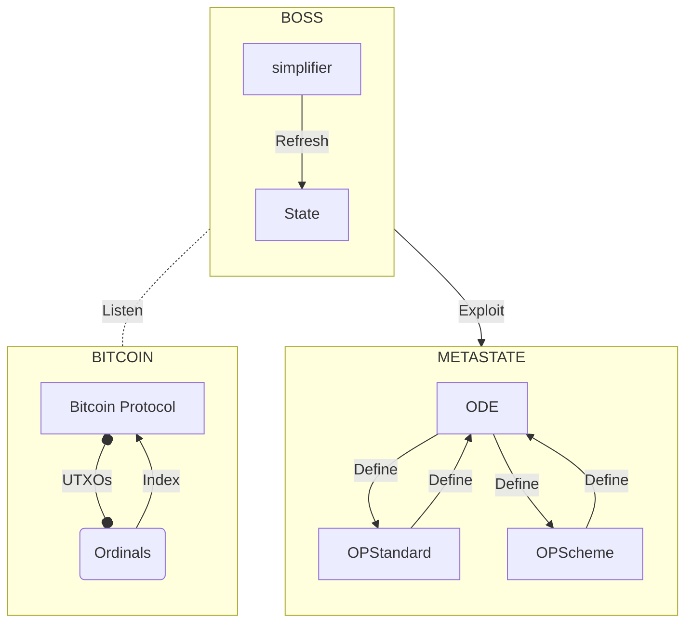

# Lightpaper

```
Version: 0.01
Rev: 2023-06-13
```

> [Download this paper](https://github.com/opstandard/Boss/blob/main/lightpaper.pdf)


In the quest to improve the operational potential of the Bitcoin network, the _BOSS (Bitcoin Operational Standard System_) framework is emerging as a revolutionary solution. 

**BOSS is a unique meta-indexing architecture based on a standardized transaction tagging system built on Ordinals, where trust is firmly established by the Bitcoin peer-to-peer protocol and the Ordinals indexing system.**

This lightpaper covers :

- An introduction to [OPstandard](/specs/opstandard), the robust dialectic framework for describing complex protocols using the popular JSON (JavaScript Object Notation) exchange format.

- An introduction to the concept of Simplifier, a decentralised indexing and ingestion node capable of interpreting as transactional instructions registrations (then called smart-inscriptions) compatible with known protocol schemes.

- An introduction to the concept of ODE (Operational Decentralized Entity), a low-level governance protocol that gives users full powers to administer the solution as soon as it is implemented.

Our proposal describes this modus operandi, which is capable of interpreting complex and intertwined protocol logics. 

This proposal is revolutionary to the point of making it possible, natively and without the exploitation of overloads such as oracles, to exploit off-chain data in transactional input circuits described by living on-chain protocols.

By merging the concept of intelligent inscriptions with its components, BOSS is proposing a revolution in the technical landscape of timechain, opening up new possibilities for developers, investors and users.

> We are confident that BOSS is paving the way for the development of a new generation of decentralised applications supported by and for the Bitcoin network.

_Code source : https://github.com/opstandard_

## Preamble

_In initiating our work on this proposal, our primary aim was to conceptualise the protocol par excellence for exchanging BRC-20s. However, we quickly realised that achieving this goal would require the active engagement of developers, investors and users. As a result, we set out to design a neutral environment that would encourage experimentation and promote adoption._

_The result is the OPStandard, an ingenious approach based on the JSON format for defining protocol instructions. The standard was developed to ensure compatibility with the BOSS architecture. To ensure its long-term relevance, we have set up a system for updating it within a flexible community framework._

_Our ambitions transcend the simple creation of a library of protocols. We also aim to observe and exploit the internal state of these protocols as reliable, real-time data. It is therefore imperative to maintain these libraries and standards in a secure and open source manner._

_With this in mind, we have developed ODE, a scalable protocol solution that addresses the governance challenges raised by BOSS. ODE is the epicentre of a decentralised agora within the BOSS architecture, a space where anyone can propose a protocol revision. ODE lists all the protocol definitions that can then be exploited in a collectively managed trust register._

_It's with this approach that we're taking the liberty today of initiating the first OIP for Ordinals Improvements Proposal by publishing the first protocol lightpaper on ordinals._

**_Dear members of our community of experimenters, Do you understand how robust the fabric of trust is now? It's time to seize this opportunity to create the routines and innovation that will shape tomorrow's world, in an environment where nothing can disappear and everything lasts forever._**

## History

The history is important to understand in order to understand the design, the main developments and the future.

**October 2008 - Birth of bitcoin's white paper**, which was an academic paper describing a system allowing any individual to pay himself without a central authority, such as a bank or other player commonly known as a "middleman".

**January 2009 - The bitcoin network is up and running**One of the keys to the network is timechain, a tool that lists the history of financial transactions from person A to person B. Other people were thinking about the possibility of different types of non-financial exchange. The first entry in OP_CODE was introduced by Satoshi Nakamoto himself in the genesis block: 'The Times 03/Jan/2009 Chancellor on brink of second bailout for banks'.


```
Number of transactions: 1
Total production: 50 BTC
Estimated volume of transactions: 0 BTC
Transaction fees: 0 BTC
Size: 0 (Main string)
Date (timestamp) : 2009-01-03 18:15:05
Time received: 2009-01-03 18:15:05
Relayed by : Unknown
Difficulty 1.00
Bits 486604799
Size: 0.2783203125
KB Version: 1
nonce : 2083236893
Block reward : 50 BTC
Hash : 000000000019d6689c085ae165831e934ff763ae46a2a6c172b3f1b60a8ce26f
Previous block: 0000000000000000000000000000000000000000000000000000000000000000
Next block(s): 00000000839a8e6886ab5951d76f411475428afc90947ee320161bbf18eb6048
Merkle root: 4a5e1e4baab89f3a32518a88c31bc87f618f76673e2cc77ab2127b7afdeda33b

Receiving address: 1A1zP1eP5QGefi2DMPTfTL5SLmv7DivfNa
```

**December 2013 - Vitalik Buterin gives birth to the white paper Ethereum, the smart contract revolution**, which was originally an academic paper. For Vitalik, the bitcoin network was too simple by its very nature, and he therefore plans to use blockchain for much more complex applications. 

In fact, he describes Ethereum for creating crypto-currencies, domain names registration systems, and betting applications. 

Vitalik's ideal world was not to use the Ethereum network just to transfer money, but he wanted to use this innovation to create much more advanced applications, using smart contracts. Smart contracts are programmed to do certain things by a person or another contract and to send a message or instruction to that person, smart contracts are the heart of Ethereum.


**July 2014 - The ethereum network is up and running**, and continues to grow through its smart contracts and more advanced functions.


**14 December 2022 - The first ordinal**, a pixelated work of art depicting a skull, is inscribed on the Bitcoin timechain by Casey Rodarmor, marking the launch of the Bitcoin ordinal protocol.


**January 2023 - The Bitcoin Ordinal protocol is officially introduced,** it facilitates the deployment of digital content on the bitcoin timechain.

**February 2023 - The Bitcoin ordinal craze** starts to increase, with the number of registrations doubling every week for a few weeks. This period marks significant growth and increased adoption of ordinals.


**June 2023 - TheOrd introduces BOSS, making it possible to create much more advanced applications on the Bitcoin network.** BOSS, the global metaprotocol and toolkit for the bitcoin network's smart registration platform.

> TheOrd, aware of the simplicity of the Bitcoin network, envisaged using timechain technology for more complex applications and using this innovation to develop advanced applications thanks to Smart Inscriptions. Smart Inscriptions are programmed to perform certain actions in response to instructions from a person or another contract, which is the heart of the BOSS.

**BOSS operating diagram**


We will shortly be making a JavaScript library available through the BTCBoss.JS package. This will provide an essential interface for programmatic access to the BOSS infrastructure. This interface will make it easier for developers to interact with the Bitcoin timechain and Boss using code. Thanks to this Boss client, it will be possible to design applications that connect directly to the Bitcoin timechain, carry out transactions, retrieve data and exploit the sophisticated functionalities of intelligent protocols, also known as smart inscriptions.

Using this powerful library, developers can explore the opportunities offered by the bitcoin network and create innovative decentralised applications in the field of decentralised finance (DeFi) and beyond.


## Introduction

Innovation in decentralised applications using bitcoin and BRC-20 is based on advanced operational protocols, commonly known as smart protocols.

In order to meet the challenges associated with these protocols, which are flourishing by the day, we are proud to present the decentralised framework BOSS, for Bitcoin Operational Standardized System, which will of course be made public as open source shortly.

At the highest level, BOSS is an architecture that standardises the development and execution of smart protocols. BOSS is based on the Ordinals Protocol Standard (OPStandard) - a markup schema designed for the community, maintained by the community, and soon to be available on [github](https://github.com/opstandard).

Smart protocols are distinguished from smart contracts by their strict operational nature and their collective definition by community consensus. At the heart of this mechanism is intelligent inscription, also known as intelligent instruction or operation, which enables a protocol to react by observing these inscriptions before applying to its own state the mutations described by the protocol schema. 

In other words, these inscriptions serve as secure cookies for updating the virtual state of a protocol.

Once indexed, a smart inscription is ingested and digested, enabling the state of the protocol to be manipulated directly. This approach differs from the usual mechanics of a smart contract, which is based on complex conditional logic and requires execution in a context that reproduces on-chain constraints.

The concept of smart protocols opens up new possibilities in the field of decentralised applications by exploiting the potential of timechain and smart contract technologies. Thanks to instruction cookies, developers will benefit from unprecedented flexibility to implement a variety of actions, from simple status updates to complex calculations and interactions with external smart contracts.

> Smart inscriptions add significant value to the Bitcoin network. They allow the virtual state of a protocol to be updated efficiently and securely, facilitating direct manipulation and dynamic evolution of its state. These advances open up new ways of using the Bitcoin network.

By exploiting smart inscriptions, developers can explore new possibilities in decentralised applications. They have unprecedented flexibility to implement a wide range of actions, from simple status updates to complex calculations and interactions with external smart contracts.

However, the implementation and development of operational ordinal protocols are not without their challenges.

Developers have to navigate through :

- The inherent technical complexity
- The need for confidence in the protocol data
- The lack of a dedicated development environment
- The difficulties associated with updating the protocol
- Harmonisation of data types
- The need for commitment from the entire ecosystem

This is where the BOSS framework comes in. Developed by the TheOrd team under the supervision of [M3rl1n](https://twitter.com/M3rl1nOg), BOSS offers a solution to these challenges:

> This decentralised framework is based on a standard: the OPStandard. This standard offers a standardised and scalable approach capable of describing an operational protocol. The OPStandard uses the international standard [JSONSchema Draft 2020-12](https://json-schema.org/draft/2020-12/release-notes.html) and acts as a meta-protocol, providing a specification for the syntax of the data schemas of a protocol (called OPScheme). This approach allows precise translation of schemas into operational instructions that can be executed in different environments, including indexers.

BOSS also offers a software solution, unveiled under the name of "simplifiers", capable of absorbing smart inscriptions and consolidating protocol state updates. These simplifiers play a crucial role in this process by indexing and processing smart inscriptions, thus contributing to the consolidation of the state of the protocol. It is important to emphasise that these indexers are distinct from cryptographic nodes: their role is not to validate atomicity based on the state of a quorum of selected nodes in the operational network, but rather to observe.

By adopting BOSS, simplifiers and developers benefit from a standardised framework, fair remuneration, improved understanding, the potential for protocol interoperability and a secure execution environment. The holistic approach of BOSS aims to overcome the challenges faced by smart protocols, paving the way for their widespread adoption in decentralised applications.

Note: The information provided above is intended to introduce the topic of BOSS, a decentralized framework for operational ordinal protocols, in the context of timechain technology education. The focus is on Bitcoin and BOSS indexers.

## Challenges

Operational protocols currently face a number of major obstacles that limit their adoption and hinder the development of innovations. These challenges can be grouped into four main categories:

**1. Abstract technical complexity:**
Ordinal operational protocols have an inherent technical complexity, which can make them difficult to understand for novice users and developers. The design, implementation and maintenance of these protocols require advanced technical skills, restricting their understanding, accessibility and use.

**2. Confidence in protocol data:**
Operational protocols rely on data and instructions ingestion to update their state. Trust in the accuracy and integrity of this data is crucial for ensuring proper protocol functioning. However, this trust is often questioned as it relies solely on indexers, web services that provide a synchronized view of the protocol's state with the Bitcoin timechain. Indexers are developed based on subjective opinions, which can compromise the reliability of protocol data.

>"These challenges require academic attention, with the entire Bitcoin ecosystem contributing to the development of solutions to overcome these obstacles and drive wider and more efficient adoption of ordinal operational protocols." - M3rl1n

**3. Lack of a dedicated development environment:**
Users or developers wishing to create new ordinal operational protocols generally lack a standardised development environment to describe the functionality of these protocols. This makes it difficult to share, understand and collaborate on these protocols. The lack of tools and environments specifically designed for operational protocols hinders their adoption and effective development.

**4. Difficult protocol updates**
Operational protocols are inherently dynamic and must be able to evolve and be updated to meet the changing needs of the community. However, updating these protocols is often complex and risky. Indexers, who play a crucial role in applying corrections or modifications, have already developed their protocol processing routines, making it difficult to apply updates automatically. Coordinating the actors involved in protocol updates is a major challenge, and update errors can have serious consequences for the security and stability of the protocol.

**Our architecture tackles the problem of hyper-centralisation of protocol indexers.**

1. It must be possible for anyone to ensure that a protocol instruction flow is processed correctly and produces the expected result.
2. Issues relating to the updating of these protocols must be anticipated.

## Solution: BOSS 


**BOSS for Bitcoin O-perational Standard System is a proposed standard and operational architecture designed to standardize the processing of intelligent registrations.

BOSS is a holistic solution with its own vocabulary. 

### A typical transaction

1. Bitcoin transactions are represented as unspent transaction output (UTXOs) and pass through the Bitcoin protocol. They are then analysed by Ord, the Ordinal protocol, which indexes them according to Ordinal(1) protocol standards.

2. The simplifiers(2) in the BOSS ecosystem, who have a Bitcoin node installed on their mainframe, retrieve and interpret the data using the OPstandard and the Ode protocol registry. Ordinal transactions that follow the OpScheme(3) standard and can be exploited by the MetaState(4) are considered to be Smart Inscriptions.

3. The Metastate includes the Meta register, which contains the ODE(5) protocol and the OPStandard definition.


Ordinals introduces a new way of reaching consensus on developments driven by the weight of the Bitcoin network. We had a timechain, now we have an indexer.

### Definitions of the components of the BOSS solution

1. __Protocole Ordinal (op):__
An Ordinal Protocol (op) is defined as a schema which describes the mechanisms to be implemented when registrations compatible with the protocol are indexed. An op groups together a set of rules that describe the protocol mechanisms for processing registrations, such as the mechanisms that lead to the use of brc-20s by out-of-chain processes.

2. __simplifier/ Bitcoin Virtual Machine (BVM):__
The Bitcoin Virtual Machine (BVM), a BOSS software solution, ingests smart registrations and consolidates protocol status updates in collaboration with BOSS notaries. BOSS notaries index and process registrations according to defined instructions, increasing confidence in the execution of protocol operations.

3. __OpScheme:__
BOSS introduces the concept of OpScheme, an ordinal protocol schema compliant with the OPStandard. This enables operational protocols to be defined and shared in a clear and standardised way, making it easier to understand, analyse and explore the interactions between protocols, while at the same time promoting significant advances in research into operational protocols.

4. __OpStandard:__
BOSS introduces OpStandard, a structured data markup schema that can be supported by all indexers, regardless of their technology stack.

4. __MetaState and Meta:__
BOSS uses Meta, a version registry protocol compatible with the ODE governance system. Meta encapsulates deployed protocols in a standard format that can be used by BOSS simplifiers and provides a means of exploring best practice for ensuring compatibility and security between different versions of operational protocols.

5. __ODE Protocol:__
BOSS uses the Operations Decentralized Entity (ODE) protocol, a permissionless protocol governance standard that enables decentralized and transparent governance of operational protocols. ODE plays a key role in the governance of operational protocols within BOSS, providing academic research opportunities to analyse governance mechanisms, economic incentives and voting mechanisms, with the aim of improving the stability and evolution of operational protocols.

The definitions and standards we propose are subject to proposed improvements that will be discussed and voted on at ODE, the first Bitcoin DAO. The brc-20 protocol has been integrated into the BOSS ecosystem and is fixed in its current state (it cannot be updated). It is a primitive, whose central role in the BOSS architecture will be explained in more detail in the chapter on vision.

> Our proposal is global, but is itself based on very open governance principles. All the models developed within the BOSS architecture can be discussed, examined and modified by the community via the governance protocol known as ODE.

#### The BOSS's vision

BOSS envisages a polymorphic cyber-architecture based on a minimum of constraints. Data generated by humans in an intelligible format is treated as explicit and coherent instructions, with guaranteed immutability. This flow of information relies on bitcoin to immortalise its existence in history.

BOSS supports the idea that the protocol instruction, or the intention expressed at a given moment, is the only certainty we have. Through our proposal, you will discover that beyond past intention, this architecture introduces a new certainty: correct interpretation and the certainty of being able to reinterpret signals perceived in the past, where what is deemed correct is forged and then recognised with the same certainty by the community.

These signals are interpreted by programs (protocols) that are defined within the ecosystem via a schema (OPScheme), based on an open standard co-developed by the community (OPStandard). This standard is simple, monitored, scalable and maintained through the ODE governance protocol.

This architecture introduces the concept of a 'simplifier', an autonomous 'sensitive' unit that declares itself capable of ingesting a protocol instruction in accordance with the OPStandard in order to interpret an instruction flow.

These simplifiers can act in accordance with the trust register administered by ODE, or dissociate themselves from it to meet their own needs.

We will shortly be addressing the issues of incentives and the integrity of data from simplifiers.

## More resources 

<PageLink title="Overview of ODE" desc="1st DAO on Bitcoin" href="/protocols/ode" />
